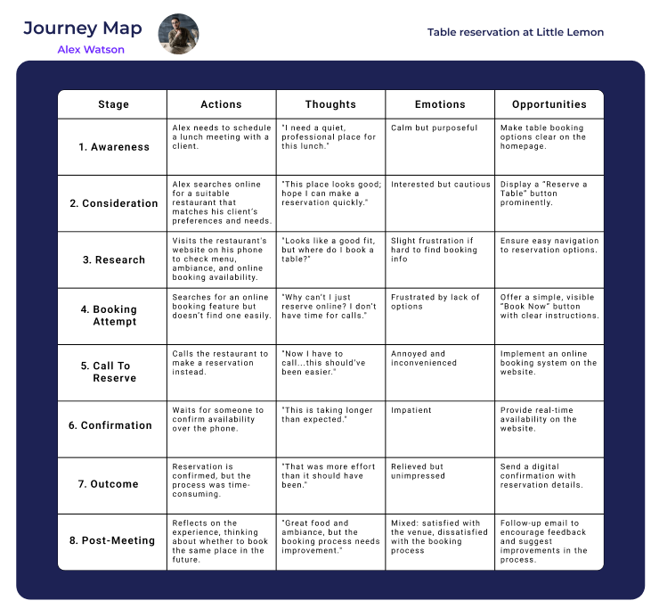
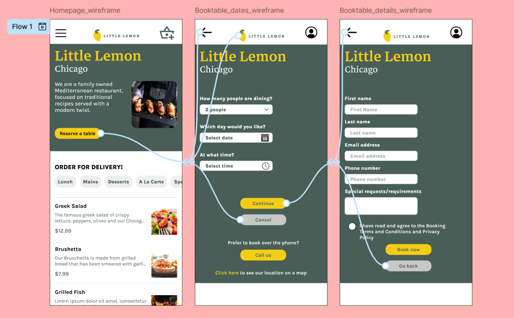

# **Figma Files: Principles of UX/UI Design**

This repository contains Figma files created as part of the [Meta Principles of UX/UI Design](https://www.coursera.org/learn/meta-ux-ui-design) course. The course explores foundational design principles and best practices for creating effective user experiences and interfaces.

## **About the Repository**

This repository serves as a collection of Figma projects developed during the course. Each file represents key concepts and techniques applied in UX/UI design, including:

- Wireframing and prototyping
- Hierarchy and layout principles
- Color theory and typography
- Accessibility considerations

## **Screenshot**

  
*Practicing text hierarchy and working with columns and grids*

*Creating a persona while researching user groups*

*Creating a journey map while conducting UX research*

*Working with wireframes, style guides and building prototypes*

## **Learning Objectives**

By completing this course and repository, I developed skills in:

- Translating user needs into intuitive designs
- Applying fundamental principles of UX/UI design
- Creating interactive prototypes for testing
- Designing accessible and aesthetically pleasing user interfaces

## **Acknowledgements**

- A big thank you to the [Meta UX/UI Design Certificate](https://www.coursera.org/learn/meta-ux-ui-design) team for providing a well-structured and comprehensive course.
- Inspired by Meta’s commitment to promoting excellent design practices.

## **License**

This repository is for educational purposes only. Please do not use these designs as your own in any submissions or projects.
